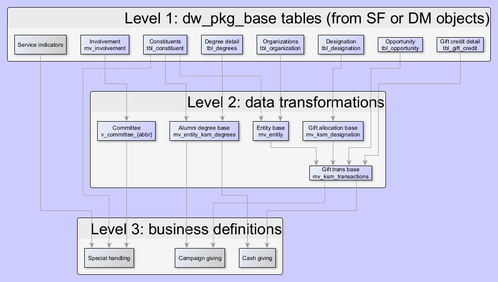

# NU and Kellogg PL/SQL definitions

Contains SQL and PL/SQL code for various Kellogg data definitions and best practices.

# Data hierarchy

Concept: lower level tables should be defined based on SF objects, then joined/transformed into higher level definitions. Data packages should have clear hierarchical dependencies, and a single responsibility.

WIP as of May 2025. Blue are available for testing in PRD.

# Naming conventions

`id_type_description`

 * `dw_pkg_`: package/view accessing SF objects or DW tables; should be very fast
 * `ksm_pkg_`: KSM specific package/view dependent on other packages/views
 * `mv_`: refreshing materialized views, fast indexed versions of dw_pkg and ksm_pkg definitions
 * `tbl_`: tables and non-refreshing materialized views; should be recompiled to update
 * `v_`: general views
 * `tableau_`: Tableau views

Examples

 * `ksm_pkg_utility` wraps various utility functions, such as to_number_from_dollar()
 * `dw_pkg_base` contains the cursor/logic to format base objects/tables including constituent, organization, etc.

# Materialized view refresh

To facilitate pulling the important definitions contained in the `ksm_pkg` packages, materialized views are scheduled to refresh daily. See [ksm_mv_scheduler.sql](tables/ksm_mv_scheduler.sql) for the set of scheduled views.

If new materialized views are scheduled, the specs should be added to the above file, and last refresh and ETL times added to the view [ksm_mv_refresh_stats.sql](tables/ksm_mv_refresh_stats.sql).

Important: respect dependencies! For example, `mv_ksm_transactions` is scheduled 10 minutes after `mv_entity` -- see their respective package descriptions.

# Important views

 * [mv_entity](packages/ksm_pkg_entity.pck) = merged constituent and org tables, with consistent household definition (org ultimate parent is the hh primary). See `c_entity`
 * [mv_entity_ksm_degrees](packages/ksm_pkg_degrees.pck) = KSM alumni definition, plus concatenated degrees. See `c_entity_degrees_concat`
 * [mv_ksm_designation](packages/ksm_pkg_designation.pck) = KSM gift designations, including cash and campaign categories. See `c_ksm_designation`
 * [mv_ksm_transactions](packages/ksm_pkg_gifts.pck) = KSM hard and soft credit to all KSM designations. See `c_ksm_transactions`