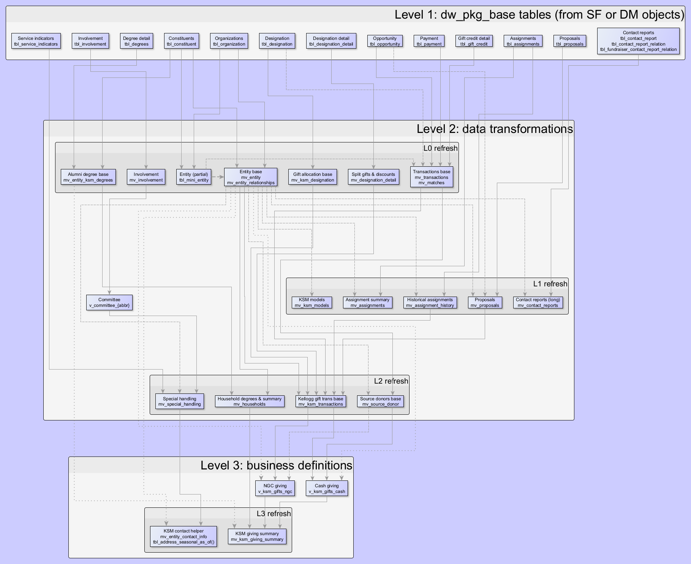

# NU and Kellogg PL/SQL definitions

Contains SQL and PL/SQL code for various Kellogg data definitions and best practices.

# Data hierarchy

WIP as of Apr 2025.

Concept: lower level tables should be defined based on SF objects, then joined/transformed into higher level definitions. Data packages should have clear hierarchical dependencies, and a single responsibility.

# Naming conventions

`id_type_description`

 * `dw_pkg_`: package/view accessing SF objects or DW tables; should be very fast
 * `ksm_pkg_`: KSM specific package/view dependent on other packages/views
 * `v_`: general views
 * `tableau_v_`: Tableau views

Examples

 * `ksm_pkg_utility` wraps various utility functions, such as to_number_from_dollar()
 * `dw_pkg_base` contains the cursor/logic to format base objects/tables including constituent, organization, etc.

# Important views

TBD